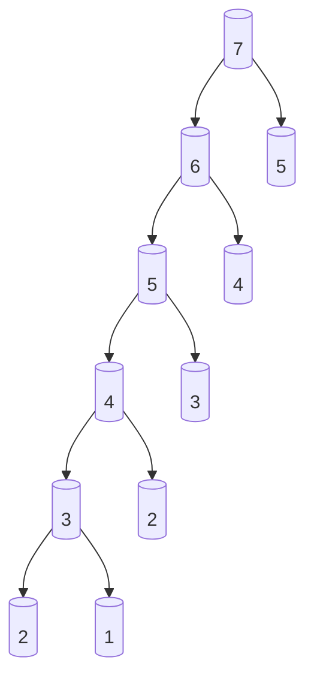
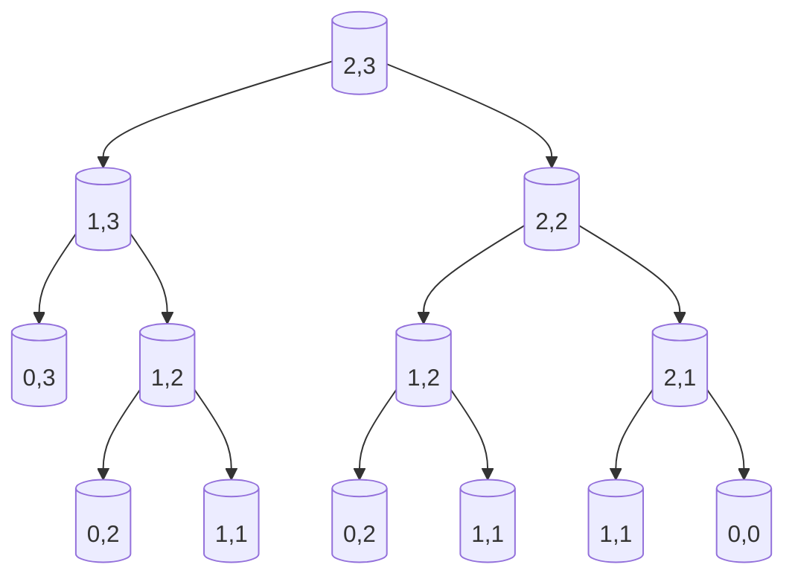

# Dynamic Programming - Learn to Solve Algorithmic Problems & Coding Challenges

Here's a simple JavaScript function to calculate the Fibonacci sequence using recursion:

```javascript
function fibonacci(n) {
  if (n <= 1) {
    return n;
  }
  return fibonacci(n - 1) + fibonacci(n - 2);
}

console.log(fibonacci(10)); // Output: 55
```

This function recursively calculates the Fibonacci number at position `n`. However, this method has exponential time complexity and can be slow for large values of `n`. Here's an optimized version using dynamic programming to improve performance:

```javascript
function fibonacci(n) {
  let fib = [0, 1];
  
  for (let i = 2; i <= n; i++) {
    fib[i] = fib[i - 1] + fib[i - 2];
  }
  
  return fib[n];
}

console.log(fibonacci(10)); // Output: 55
```

This dynamic programming approach has a time complexity of O(n) and is much more efficient for larger values of `n`.

## Memoization

Memoization is a great way to improve the efficiency of the recursive Fibonacci function by storing previously calculated values. This reduces redundant calculations, giving a time complexity of O(n) without the need for an iterative approach.

Here’s how you can implement memoization:

### Memoized Recursive Fibonacci Function

```javascript
function fibonacci(n, memo = {}) {
  if (n in memo) return memo[n];
  if (n <= 1) return n;
  
  memo[n] = fibonacci(n - 1, memo) + fibonacci(n - 2, memo);
  return memo[n];
}

console.log(fibonacci(10)); // Output: 55
```

### How it Works:
- We pass an object `memo` that stores the Fibonacci values already computed.
- Before calculating the Fibonacci value of `n`, the function checks if it's already in `memo`. If it is, the stored value is returned, avoiding recalculation.
- If not, the function computes the value and stores it in `memo` for future use.

This method retains the simplicity of the recursive approach while offering the performance benefits of dynamic programming by avoiding duplicate calculations.

## JavaScript, arrays do not always allocate a fixed memory space

You're correct that in JavaScript, arrays do not always allocate a fixed memory space like in lower-level languages such as C or C++. Arrays are dynamically sized, and memory reallocation happens as they grow. This can cause performance issues, especially for large datasets or performance-critical applications, as memory allocation and resizing may occur frequently.

To mitigate these concerns and improve performance, you can consider the following strategies:

### 1. **Pre-allocate Memory for Arrays**
By pre-allocating a fixed size for arrays, you can avoid frequent memory reallocations and resizing during runtime.

#### Example:
```javascript
function fibonacci(n) {
  const fib = new Array(n + 1);  // Pre-allocate memory
  fib[0] = 0;
  fib[1] = 1;
  
  for (let i = 2; i <= n; i++) {
    fib[i] = fib[i - 1] + fib[i - 2];
  }
  
  return fib[n];
}

console.log(fibonacci(10)); // Output: 55
```

In this example, the `new Array(n + 1)` allocates memory upfront, reducing the number of memory allocations required during execution.

### 2. **Iterative Approach with Constant Space**
Instead of storing all Fibonacci numbers, you can optimize further by only keeping track of the last two values. This reduces the memory usage to O(1) (constant space complexity).

#### Example:
```javascript
function fibonacci(n) {
  if (n <= 1) return n;
  
  let prev = 0, curr = 1;
  
  for (let i = 2; i <= n; i++) {
    const next = prev + curr;
    prev = curr;
    curr = next;
  }
  
  return curr;
}

console.log(fibonacci(10)); // Output: 55
```

This version doesn’t require an array at all, but instead uses just two variables (`prev` and `curr`), which significantly reduces memory usage while maintaining O(n) time complexity.

### 3. **Typed Arrays**
If you're working with large datasets and want more control over memory, consider using **Typed Arrays** like `Int32Array` or `Float64Array`. Typed arrays are closer to the low-level array structures in languages like C, and they offer better performance for numerical computations as they store data in a more memory-efficient way.

#### Example Using `Int32Array`:
```javascript
function fibonacci(n) {
  const fib = new Int32Array(n + 1);  // Pre-allocated, fixed-size typed array
  fib[0] = 0;
  fib[1] = 1;

  for (let i = 2; i <= n; i++) {
    fib[i] = fib[i - 1] + fib[i - 2];
  }

  return fib[n];
}

console.log(fibonacci(10)); // Output: 55
```

Typed arrays ensure that each element is stored in a fixed number of bytes (e.g., `Int32Array` uses 4 bytes per element), which reduces overhead and improves cache efficiency.

### Summary of Improvements:
- **Pre-allocate memory**: Allocate arrays with a fixed size to avoid dynamic resizing.
- **Constant space optimization**: Use an iterative approach with only two variables to minimize memory usage.
- **Typed Arrays**: Use `TypedArray` for improved memory efficiency, especially when dealing with large data or numerical computations.

These strategies can help improve the performance of JavaScript Fibonacci implementations, especially for large inputs or performance-critical scenarios.

## Fibonacci diagram

Here is a Fibonacci diagram of calculating `fibonacci(7)`:



### Explanation:
1. `fibonacci(3)` breaks into `fibonacci(2)` and `fibonacci(1)`.
2. `fibonacci(2)` breaks into `fibonacci(1)` and `fibonacci(0)`.
3. `fibonacci(1)` and `fibonacci(0)` return 1 and 0, respectively, while other `fibonacci(1)` also returns 1.

This represents the recursive calls that happen during the calculation of `fibonacci(3)` with 7 interactions.

Yes, you are correct! Here's the complexity breakdown of a **memoized Fibonacci** function:

### **Time Complexity: O(n)**
- In a memoized Fibonacci function, each value from `fibonacci(0)` to `fibonacci(n)` is calculated **once** and then stored in memory (i.e., memoized). 
- The recursion only happens for new values that haven't been calculated yet. Once a value is computed, it's fetched directly from the memo, which takes constant time, `O(1)`.
- Thus, there are `n` recursive calls, and each call does `O(1)` work after memoization is applied.
- Overall, this results in a time complexity of **O(n)**.

### **Space Complexity: O(n)**
- The memoization technique requires storing the results of `fibonacci(0)` through `fibonacci(n)` in memory.
- Since we're storing `n + 1` values in the memo object (or array), the space required is proportional to `n`, which results in **O(n)** space complexity.
  
In summary:
- **Time Complexity**: `O(n)` (due to memoization and each Fibonacci value being calculated once).
- **Space Complexity**: `O(n)` (due to storing all Fibonacci values up to `n` in memory).

## A Grid Traveler 
To solve the `gridTraveler(m, n)` problem, we can approach it similarly to how we solved the Fibonacci sequence — using **recursion** and **memoization** to optimize.

### Problem Breakdown:
- If you are on a grid of size `m x n`, you can only move **right** or **down**.
- The base cases:
  - If you're on a 1x1 grid, there's only **1 way** to travel (you're already at the destination).
  - If either `m = 0` or `n = 0`, there are **0 ways** to travel (you can't move on a zero-dimension grid).
  
For each grid, the total number of ways to travel is the sum of:
1. **Moving right**: Which leaves a grid of size `(m, n-1)`.
2. **Moving down**: Which leaves a grid of size `(m-1, n)`.

This results in a recursive formula:
```
gridTraveler(m, n) = gridTraveler(m-1, n) + gridTraveler(m, n-1)
```

### Memoized Recursive Solution:

```javascript
function gridTraveler(m, n, memo = {}) {
  // Check if the value is already in the memo
  const key = m + ',' + n; // Key as "m,n" to handle grid size combinations
  if (key in memo) return memo[key];
  
  // Base cases
  if (m === 0 || n === 0) return 0; // No ways to travel on 0 dimension grid
  if (m === 1 && n === 1) return 1; // Only one way to travel on 1x1 grid
  
  // Store the result in the memo before returning
  memo[key] = gridTraveler(m - 1, n, memo) + gridTraveler(m, n - 1, memo);
  
  return memo[key];
}

console.log(gridTraveler(2, 3)); // Output: 3
console.log(gridTraveler(3, 3)); // Output: 6
```

### Explanation:
- **Base cases**: We handle the 1x1 grid and the 0-dimension grid cases.
- **Memoization**: We use a JavaScript object `memo` to store previously calculated results for a specific grid size (keyed by `"m,n"`). This reduces the number of redundant recursive calls and improves the time complexity from exponential to polynomial.

### Time and Space Complexity:
- **Time Complexity: O(m * n)**: There are `m * n` distinct subproblems, and each subproblem is solved only once.
- **Space Complexity: O(m * n)**: Due to the memoization table, we store `m * n` grid sizes. The recursion stack also goes up to `O(m + n)` deep.

## A grid traveler diagram

The diagram clearly shows the recursive breakdown of the `gridTraveler(2,3)` problem.



Here's a detailed explanation of the diagram:
- Starting at `(2,3)`, there are two main paths:
  1. Move **down** to `(1,3)`
  2. Move **right** to `(2,2)`

- From `(1,3)`, the choices are:
  1. Move **down** to `(0,3)` (invalid as there's no movement possible from here)
  2. Move **right** to `(1,2)`

- From `(2,2)`, the choices are:
  1. Move **down** to `(1,2)`
  2. Move **right** to `(2,1)`

- This breakdown continues until all paths eventually reach `(1,1)` or `(0,0)` (invalid state), which represents the successful traversal paths or dead ends.

This visualization helps to understand the recursive nature of the `gridTraveler` problem and how each move reduces the problem to smaller grids until it reaches the base case (either `(1,1)` or an invalid grid).

## Videos

* [Dynamic Programming - Learn to Solve Algorithmic Problems & Coding Challenges](https://www.youtube.com/watch?v=oBt53YbR9Kk)
	> [](https://www.youtube.com/watch?v=oBt53YbR9Kk "Dynamic Programming - Learn to Solve Algorithmic Problems & Coding Challenges by Bouali Ali 51,714 views 3 hours, 17 minutes")
