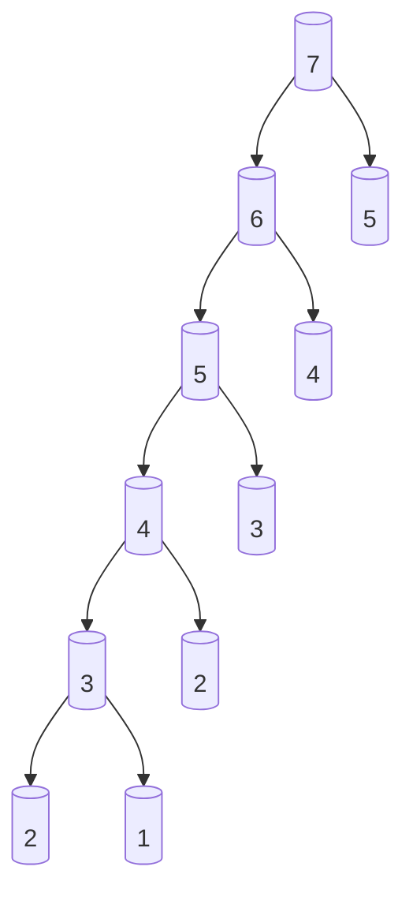
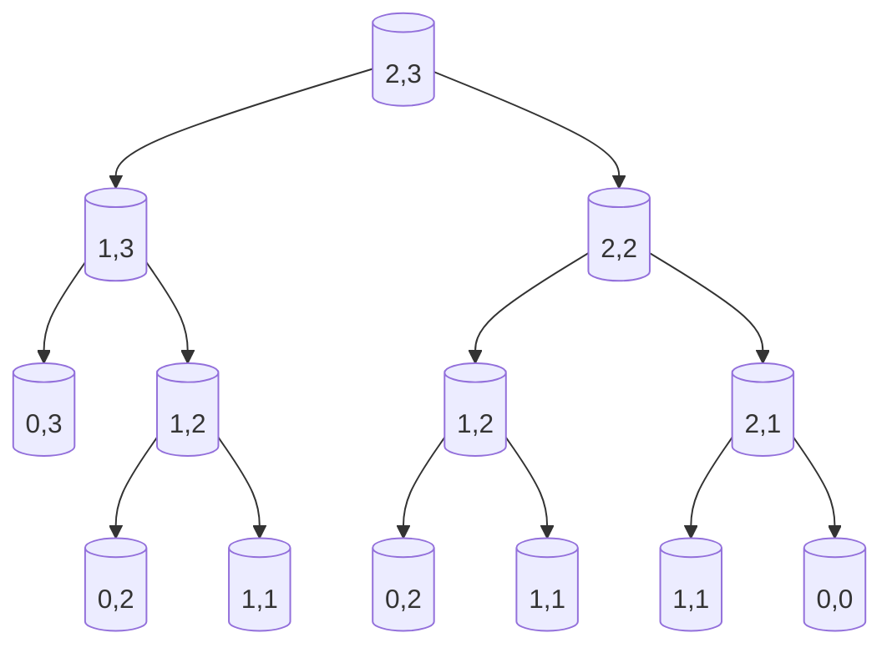
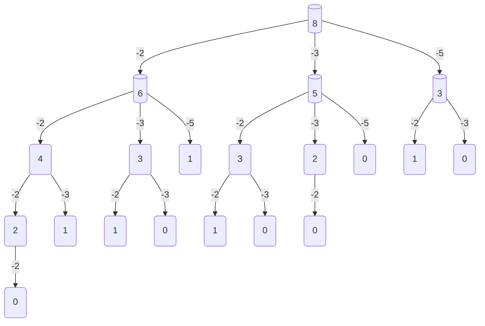
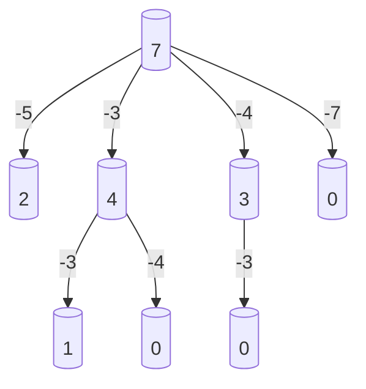
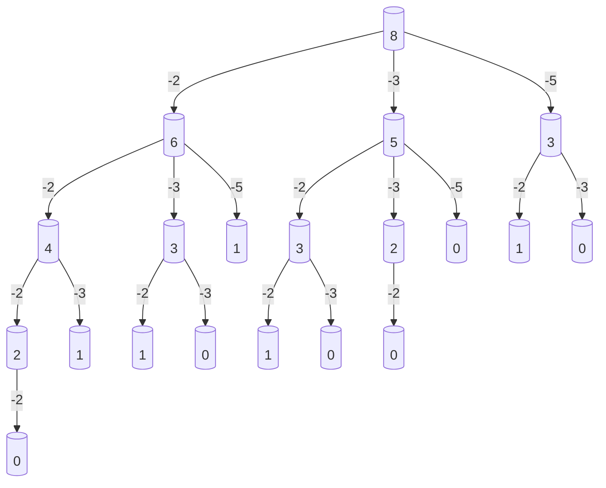
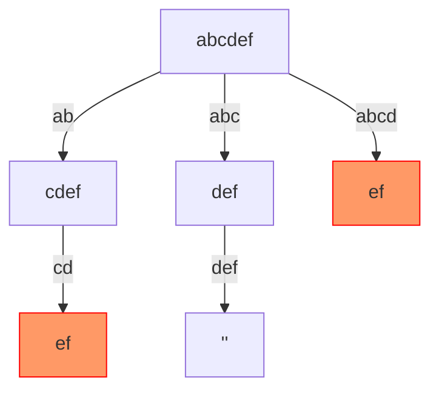
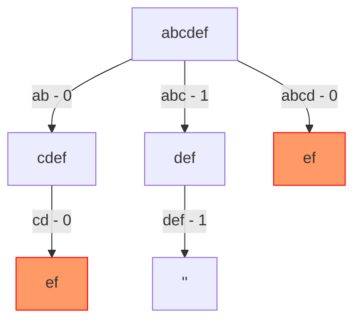
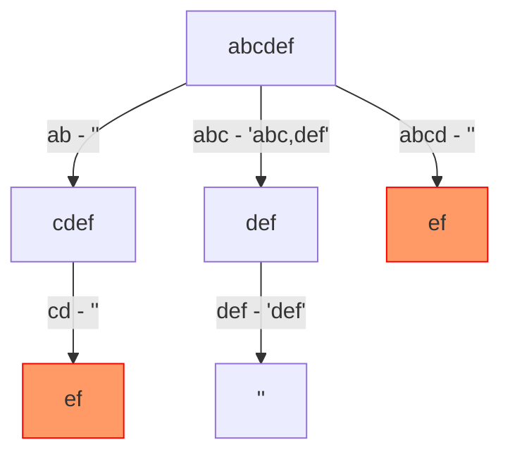

# Dynamic Programming

## Course Contents

- [Dynamic Programming](#dynamic-programming)
  - [Course Contents](#course-contents)
  - [Introduction](#introduction)
  - [Fibonacci](#fibonacci)
    - [Fibonacci diagram](#fibonacci-diagram)
    - [Explanation Fibonacci diagram](#explanation-fibonacci-diagram)
    - [**Time Complexity: O(n)**](#time-complexity-on)
    - [**Space Complexity: O(n)**](#space-complexity-on)
  - [Memoization](#memoization)
    - [Memoized Recursive Fibonacci Function](#memoized-recursive-fibonacci-function)
    - [How it Works](#how-it-works)
  - [JavaScript issues allocating memory](#javascript-issues-allocating-memory)
    - [1. **Pre-allocate Memory for Arrays**](#1-pre-allocate-memory-for-arrays)
      - [Example pre-allocating memory](#example-pre-allocating-memory)
    - [2. **Iterative Approach with Constant Space**](#2-iterative-approach-with-constant-space)
      - [Example fibonacci](#example-fibonacci)
    - [3. **Typed Arrays**](#3-typed-arrays)
      - [Example Using `Int32Array`](#example-using-int32array)
    - [Summary of Improvements](#summary-of-improvements)
  - [A Grid Traveler](#a-grid-traveler)
    - [Problem Breakdown:](#problem-breakdown)
    - [Memoized Recursive Solution](#memoized-recursive-solution)
    - [Explanation Memoized Recursive Solution](#explanation-memoized-recursive-solution)
    - [Time and Space Complexity](#time-and-space-complexity)
    - [A grid traveler diagram](#a-grid-traveler-diagram)
    - [**Memoization Recipe: Simplified**](#memoization-recipe-simplified)
    - [**Memoization Recipe**](#memoization-recipe)
    - [**Memoization Recipe Key Principles**](#memoization-recipe-key-principles)
    - [**Tips and Recommendations**](#tips-and-recommendations)
  - [canSum](#cansum)
    - [**Breakdown of the Problem**](#breakdown-of-the-problem)
    - [Recursive Function without Memoization](#recursive-function-without-memoization)
    - [Brute force Complexity](#brute-force-complexity)
    - [Optimized Solution with Memoization](#optimized-solution-with-memoization)
    - [**Explanation canSum Memoized Implementation**](#explanation-cansum-memoized-implementation)
    - [**Time and Space Complexity**](#time-and-space-complexity-1)
    - [canSum diagram](#cansum-diagram)
  - [howSum](#howsum)
    - [**Recursive Approach (Without Memoization)**](#recursive-approach-without-memoization)
    - [**Base Cases of howSum**](#base-cases-of-howsum)
    - [**Recursive Implementation**](#recursive-implementation)
    - [Brute force Complexity of howSum](#brute-force-complexity-of-howsum)
    - [**Optimized with Memoization**](#optimized-with-memoization)
    - [**Memoized Implementation**](#memoized-implementation)
    - [**Explanation howSum Memoized Implementation**](#explanation-howsum-memoized-implementation)
    - [**Memoization**](#memoization-1)
    - [**Time and Space Complexity howSum**](#time-and-space-complexity-howsum)
    - [howSum diagram](#howsum-diagram)
  - [bestSum](#bestsum)
    - [Key Idea](#key-idea)
    - [**Recursive Approach (Without Memoization)**](#recursive-approach-without-memoization-1)
    - [**Base Cases of bestSum**](#base-cases-of-bestsum)
    - [**Recursive Implementation**:](#recursive-implementation-1)
    - [Brute force Complexity of bestSum](#brute-force-complexity-of-bestsum)
    - [**Optimized with Memoization of bestSum**](#optimized-with-memoization-of-bestsum)
    - [**Memoized Implementation of bestSum**](#memoized-implementation-of-bestsum)
    - [**Explanation of bestSum Memoized Implementation**](#explanation-of-bestsum-memoized-implementation)
    - [**Time and Space Complexity of bestSum**](#time-and-space-complexity-of-bestsum)
    - [bestSum diagram](#bestsum-diagram)
  - [canConstruct](#canconstruct)
    - [**Recursive Approach**](#recursive-approach)
    - [**Base Case of canConstruct**](#base-case-of-canconstruct)
    - [**Recursive Implementation (Without Memoization)**](#recursive-implementation-without-memoization)
    - [Brute force Complexity of canConstruct](#brute-force-complexity-of-canconstruct)
    - [**Optimized with Memoization of canConstruct**](#optimized-with-memoization-of-canconstruct)
    - [**Memoized Implementation of canConstruct**](#memoized-implementation-of-canconstruct)
    - [**Explanation of canConstruct**](#explanation-of-canconstruct)
    - [**Time and Space Complexity of canConstruct**](#time-and-space-complexity-of-canconstruct)
    - [canConstruct diagram](#canconstruct-diagram)
  - [countConstruct](#countconstruct)
    - [**Recursive Approach countConstruct**](#recursive-approach-countconstruct)
    - [**Recursive Implementation (Without Memoization) countConstruct**](#recursive-implementation-without-memoization-countconstruct)
    - [Brute force Complexity of countConstruct](#brute-force-complexity-of-countconstruct)
    - [**Optimized with Memoization countConstruct**](#optimized-with-memoization-countconstruct)
    - [**Memoized Implementation**:](#memoized-implementation-1)
    - [**Explanation**](#explanation)
    - [**Time and Space Complexity countConstruct**](#time-and-space-complexity-countconstruct)
    - [countConstruct diagram](#countconstruct-diagram)
  - [allConstruct](#allconstruct)
    - [**Recursive Approach allConstruct**](#recursive-approach-allconstruct)
    - [**Recursive Implementation (Without Memoization) allConstruct**](#recursive-implementation-without-memoization-allconstruct)
    - [Brute force Complexity of allConstruct](#brute-force-complexity-of-allconstruct)
    - [**Optimized with Memoization allConstruct**](#optimized-with-memoization-allconstruct)
    - [**Memoized Implementation allConstruct**](#memoized-implementation-allconstruct)
    - [**Explanation allConstruct**](#explanation-allconstruct)
    - [**Time and Space Complexity allConstruct**](#time-and-space-complexity-allconstruct)
    - [allConstruct diagram](#allconstruct-diagram)
  - [fib](#fib)
  - [Videos](#videos)
  - [References](#references)

---

## Introduction

Dynamic Programming - Learn to Solve Algorithmic Problems & Coding Challenges

**[Download Node.js the way you want.](https://nodejs.org/en/download/package-manager)**

## Fibonacci

Here's a simple JavaScript function to calculate the Fibonacci sequence using recursion:

```javascript
function fibonacci(n) {
  if (n <= 1) {
    return n;
  }
  return fibonacci(n - 1) + fibonacci(n - 2);
}

console.log(fibonacci(10)); // Output: 55
```

This function recursively calculates the Fibonacci number at position `n`. However, this method has exponential time complexity and can be slow for large values of `n`. Here's an optimized version using dynamic programming to improve performance:

```javascript
function fibonacci(n) {
  let fib = [0, 1];
  
  for (let i = 2; i <= n; i++) {
    fib[i] = fib[i - 1] + fib[i - 2];
  }
  
  return fib[n];
}

console.log(fibonacci(10)); // Output: 55
```

This dynamic programming approach has a time complexity of O(n) and is much more efficient for larger values of `n`.

### Fibonacci diagram

Here is a Fibonacci diagram of calculating `fibonacci(7)`:



### Explanation Fibonacci diagram

1. `fibonacci(3)` breaks into `fibonacci(2)` and `fibonacci(1)`.
2. `fibonacci(2)` breaks into `fibonacci(1)` and `fibonacci(0)`.
3. `fibonacci(1)` and `fibonacci(0)` return 1 and 0, respectively, while other `fibonacci(1)` also returns 1.

This represents the recursive calls that happen during the calculation of `fibonacci(3)` with 7 interactions.

Yes, you are correct! Here's the complexity breakdown of a **memoized Fibonacci** function:

### **Time Complexity: O(n)**

- In a memoized Fibonacci function, each value from `fibonacci(0)` to `fibonacci(n)` is calculated **once** and then stored in memory (i.e., memoized). 
- The recursion only happens for new values that haven't been calculated yet. Once a value is computed, it's fetched directly from the memo, which takes constant time, `O(1)`.
- Thus, there are `n` recursive calls, and each call does `O(1)` work after memoization is applied.
- Overall, this results in a time complexity of **O(n)**.

### **Space Complexity: O(n)**

- The memoization technique requires storing the results of `fibonacci(0)` through `fibonacci(n)` in memory.
- Since we're storing `n + 1` values in the memo object (or array), the space required is proportional to `n`, which results in **O(n)** space complexity.
  
In summary:

- **Time Complexity**: `O(n)` (due to memoization and each Fibonacci value being calculated once).
- **Space Complexity**: `O(n)` (due to storing all Fibonacci values up to `n` in memory).

## Memoization

Memoization is a great way to improve the efficiency of the recursive Fibonacci function by storing previously calculated values. This reduces redundant calculations, giving a time complexity of O(n) without the need for an iterative approach.

Here’s how you can implement memoization:

### Memoized Recursive Fibonacci Function

```javascript
function fibonacci(n, memo = {}) {
  if (n in memo) return memo[n];
  if (n <= 1) return n;
  
  memo[n] = fibonacci(n - 1, memo) + fibonacci(n - 2, memo);
  return memo[n];
}

console.log(fibonacci(10)); // Output: 55
```

### How it Works

- We pass an object `memo` that stores the Fibonacci values already computed.
- Before calculating the Fibonacci value of `n`, the function checks if it's already in `memo`. If it is, the stored value is returned, avoiding recalculation.
- If not, the function computes the value and stores it in `memo` for future use.

This method retains the simplicity of the recursive approach while offering the performance benefits of dynamic programming by avoiding duplicate calculations.

## JavaScript issues allocating memory

JavaScript, arrays do not always allocate a fixed memory space like in lower-level languages such as C or C++. Arrays are dynamically sized, and memory reallocation happens as they grow. This can cause performance issues, especially for large datasets or performance-critical applications, as memory allocation and resizing may occur frequently.

To mitigate these concerns and improve performance, you can consider the following strategies:

### 1. **Pre-allocate Memory for Arrays**

By pre-allocating a fixed size for arrays, you can avoid frequent memory reallocations and resizing during runtime.

#### Example pre-allocating memory

```javascript
function fibonacci(n) {
  const fib = new Array(n + 1);  // Pre-allocate memory
  fib[0] = 0;
  fib[1] = 1;
  
  for (let i = 2; i <= n; i++) {
    fib[i] = fib[i - 1] + fib[i - 2];
  }
  
  return fib[n];
}

console.log(fibonacci(10)); // Output: 55
```

In this example, the `new Array(n + 1)` allocates memory upfront, reducing the number of memory allocations required during execution.

### 2. **Iterative Approach with Constant Space**

Instead of storing all Fibonacci numbers, you can optimize further by only keeping track of the last two values. This reduces the memory usage to O(1) (constant space complexity).

#### Example fibonacci

```javascript
function fibonacci(n) {
  if (n <= 1) return n;
  
  let prev = 0, curr = 1;
  
  for (let i = 2; i <= n; i++) {
    const next = prev + curr;
    prev = curr;
    curr = next;
  }
  
  return curr;
}

console.log(fibonacci(10)); // Output: 55
```

This version doesn’t require an array at all, but instead uses just two variables (`prev` and `curr`), which significantly reduces memory usage while maintaining O(n) time complexity.

### 3. **Typed Arrays**

If you're working with large datasets and want more control over memory, consider using **Typed Arrays** like `Int32Array` or `Float64Array`. Typed arrays are closer to the low-level array structures in languages like C, and they offer better performance for numerical computations as they store data in a more memory-efficient way.

#### Example Using `Int32Array`

```javascript
function fibonacci(n) {
  const fib = new Int32Array(n + 1);  // Pre-allocated, fixed-size typed array
  fib[0] = 0;
  fib[1] = 1;

  for (let i = 2; i <= n; i++) {
    fib[i] = fib[i - 1] + fib[i - 2];
  }

  return fib[n];
}

console.log(fibonacci(10)); // Output: 55
```

Typed arrays ensure that each element is stored in a fixed number of bytes (e.g., `Int32Array` uses 4 bytes per element), which reduces overhead and improves cache efficiency.

### Summary of Improvements

- **Pre-allocate memory**: Allocate arrays with a fixed size to avoid dynamic resizing.
- **Constant space optimization**: Use an iterative approach with only two variables to minimize memory usage.
- **Typed Arrays**: Use `TypedArray` for improved memory efficiency, especially when dealing with large data or numerical computations.

These strategies can help improve the performance of JavaScript Fibonacci implementations, especially for large inputs or performance-critical scenarios.

## A Grid Traveler 

To solve the `gridTraveler(m, n)` problem, we can approach it similarly to how we solved the Fibonacci sequence — using **recursion** and **memoization** to optimize.

### Problem Breakdown:

- If you are on a grid of size `m x n`, you can only move **right** or **down**.
- The base cases:
  - If you're on a 1x1 grid, there's only **1 way** to travel (you're already at the destination).
  - If either `m = 0` or `n = 0`, there are **0 ways** to travel (you can't move on a zero-dimension grid).
  
For each grid, the total number of ways to travel is the sum of:

1. **Moving right**: Which leaves a grid of size `(m, n-1)`.
2. **Moving down**: Which leaves a grid of size `(m-1, n)`.

This results in a recursive formula:

```javascript
gridTraveler(m, n) = gridTraveler(m-1, n) + gridTraveler(m, n-1)
```

### Memoized Recursive Solution

```javascript
function gridTraveler(m, n, memo = {}) {
  // Check if the value is already in the memo
  const key = m + ',' + n; // Key as "m,n" to handle grid size combinations
  if (key in memo) return memo[key];
  
  // Base cases
  if (m === 0 || n === 0) return 0; // No ways to travel on 0 dimension grid
  if (m === 1 && n === 1) return 1; // Only one way to travel on 1x1 grid
  
  // Store the result in the memo before returning
  memo[key] = gridTraveler(m - 1, n, memo) + gridTraveler(m, n - 1, memo);
  
  return memo[key];
}

console.log(gridTraveler(2, 3)); // Output: 3
console.log(gridTraveler(3, 3)); // Output: 6
```

### Explanation Memoized Recursive Solution

- **Base cases**: We handle the 1x1 grid and the 0-dimension grid cases.
- **Memoization**: We use a JavaScript object `memo` to store previously calculated results for a specific grid size (keyed by `"m,n"`). This reduces the number of redundant recursive calls and improves the time complexity from exponential to polynomial.

### Time and Space Complexity

- **Time Complexity: O(m * n)**: There are `m * n` distinct subproblems, and each subproblem is solved only once. `O(m * n)` time
- **Space Complexity: O(m + n)**: Due to the memoization table, we store `m * n` grid sizes. The recursion stack also goes up to `O(m + n)` deep.

### A grid traveler diagram

The diagram clearly shows the recursive breakdown of the `gridTraveler(2,3)` problem.



Here's a detailed explanation of the diagram:

- Starting at `(2,3)`, there are two main paths:
  1. Move **down** to `(1,3)`
  2. Move **right** to `(2,2)`

- From `(1,3)`, the choices are:
  1. Move **down** to `(0,3)` (invalid as there's no movement possible from here)
  2. Move **right** to `(1,2)`

- From `(2,2)`, the choices are:
  1. Move **down** to `(1,2)`
  2. Move **right** to `(2,1)`

- This breakdown continues until all paths eventually reach `(1,1)` or `(0,0)` (invalid state), which represents the successful traversal paths or dead ends.

This visualization helps to understand the recursive nature of the `gridTraveler` problem and how each move reduces the problem to smaller grids until it reaches the base case (either `(1,1)` or an invalid grid).

### **Memoization Recipe: Simplified**

1. **Make it Work**:
   - Visualize the problem as a **tree** of recursive calls.
   - Implement the logic using **recursion**.
   - Test the recursive solution to ensure correctness.

2. **Make it Efficient**:
   - Add a **memo object** to store previously calculated results.
   - Modify the base case to **return memoized values** if they exist.
   - Store return values into the **memo object** to avoid redundant computations.

This streamlined approach keeps it straightforward and helps you focus on solving the problem first, then optimizing for efficiency later!

The **Memoization Recipe** is a systematic approach for solving dynamic programming problems by breaking down complex problems into smaller, overlapping subproblems and storing their solutions to avoid redundant calculations. Here's a recommended set of guidelines to follow when solving dynamic programming problems using memoization:

### **Memoization Recipe**

1. **Make it Recursive**:
   - Start by defining the problem recursively. Focus on breaking the problem into smaller subproblems.
   - Identify the base case(s), i.e., when the recursion should stop (usually the simplest form of the problem).

2. **Identify Overlapping Subproblems**:
   - Find which subproblems are being solved repeatedly in the recursion. This is a key to applying memoization effectively.
   - If you see the same subproblem being solved more than once, that's where memoization can save time.

3. **Add Memoization**:
   - Use a data structure (such as an object or array) to store the results of each subproblem.
   - Before computing a new subproblem, check if it has already been computed and stored in the memo. If so, return the stored result instead of recomputing it.

4. **Analyze Time Complexity**:
   - Once you've added memoization, the time complexity typically becomes the product of the number of unique subproblems times the cost of computing each subproblem (usually constant with memoization).

5. **Convert to Tabulation (if needed)**:
   - While memoization is a top-down approach (starting from the problem and breaking it down into subproblems), **tabulation** is a bottom-up approach.
   - If memoization leads to recursion depth problems or inefficiency, you can convert the solution into a tabulation (iterative) form.

### **Memoization Recipe Key Principles**

- **Overlapping Subproblems**: Look for repeated subproblem calculations.
- **Optimal Substructure**: Ensure that the solution to the problem can be constructed efficiently from solutions to subproblems.
- **Store and Reuse**: Always use a memo to store results of subproblems and reuse them as needed.
  
### **Tips and Recommendations**

- **Choose the Right Data Structure**: Use objects for flexible key-value storage, or arrays for simple indices.
- **Start Simple**: Write a basic recursive solution before adding memoization. This will help you identify where memoization will optimize the solution.
- **Iterative or Recursive?**: While memoization is a top-down approach, sometimes the problem can be more efficient with an iterative (bottom-up) approach like tabulation.
- **Edge Cases**: Always consider special cases like `m = 0`, `n = 0`, or small values of `m` and `n`.

By following this memoization recipe, you can systematically approach dynamic programming problems and optimize them for performance.

## canSum

- **canSum memoization -> "Can you do it? yes/no" -> Decision Problem**

Alright, so I think it's tempting increase a difficulty. So let's work on this canSum function, what I need to do here is:
Write a function canSum(targetSum, numbers) that takes in a targetSum and an array of numbers as arguments. The function should return a boolean indicating whether or not it is possible to generate the targetSum using numbers from the array. You may use an element of the array as many times as needed. You may assume that all input numbers are nonnegative. For instance: 
canSum(7, [5,3,4,7]) -> true
canSum(7, [2,4]) -> false

The `canSum(targetSum, numbers)` problem can be solved using **recursion** and **memoization**, similar to the previous grid traveler problem. The goal is to determine if it's possible to generate the `targetSum` by summing numbers from the `numbers` array, where you can use elements of the array as many times as needed.

### **Breakdown of the Problem**

1. **Recursive Approach**:
   - Start with the `targetSum`. At each step, subtract one of the numbers from the target and recursively check if the remaining sum can be achieved.
   - If the `targetSum` becomes `0`, return `true` (since you've successfully generated the target sum).
   - If the `targetSum` becomes negative, return `false` (since it's not possible to achieve the target sum).

2. **Memoization**:
   - If the same subproblem (same `targetSum`) is being solved multiple times, store the result in a memo object to avoid redundant calculations.

### Recursive Function without Memoization

```javascript
function canSum(targetSum, numbers) {
  // Base cases
  if (targetSum === 0) return true;  // Success: reached the target sum
  if (targetSum < 0) return false;   // Failure: overshot the target sum

  // Recursively try each number
  for (let num of numbers) {
    const remainder = targetSum - num;
    if (canSum(remainder, numbers)) {
      return true; // If we can sum to the remainder, we can sum to targetSum
    }
  }

  return false; // None of the numbers could sum to targetSum
}

console.log(canSum(7, [5, 3, 4, 7])); // Output: true
console.log(canSum(7, [2, 4])); // Output: false
```

### Brute force Complexity

- **Time Complexity**: O( n <sup>m</sup> ) or O( n ^ m )
- **Space Complexity**: O(m)

### Optimized Solution with Memoization

We add a **memo object** to store the results of subproblems (different values of `targetSum`). This ensures that we don't solve the same subproblem more than once.

```javascript
function canSum(targetSum, numbers, memo = {}) {
  // Check if result is in memo
  if (targetSum in memo) return memo[targetSum];
  
  // Base cases
  if (targetSum === 0) return true;
  if (targetSum < 0) return false;
  
  // Recursively try each number
  for (let num of numbers) {
    const remainder = targetSum - num;
    if (canSum(remainder, numbers, memo)) {
      memo[targetSum] = true; // Memoize result
      return true;
    }
  }
  
  memo[targetSum] = false; // Memoize result
  return false;
}

console.log(canSum(7, [5, 3, 4, 7])); // Output: true
console.log(canSum(7, [2, 4])); // Output: false
console.log(canSum(300, [7, 14])); // Output: false
```

### **Explanation canSum Memoized Implementation**

- **Base Cases**: 
  - `targetSum === 0`: We've exactly hit the target sum, so return `true`.
  - `targetSum < 0`: We've exceeded the target sum, so return `false`.
  
- **Memoization**: 
  - We store the result for each `targetSum` in the `memo` object to avoid recalculating for the same target.
  
### **Time and Space Complexity**

- **Time Complexity**: O(n * m), where `n` is the length of the `numbers` array and `m` is the target sum. This is because there are at most `m` subproblems, and for each subproblem, we iterate through `n` numbers.
- **Space Complexity**: O(m) due to the recursion stack and the memoization object, where `m` is the target sum.

This approach makes it efficient to solve the problem even for large target sums by avoiding redundant recursive calls!

### canSum diagram

The diagram clearly shows the recursive breakdown of the `canSum(8,[2,3,5])` problem.



## howSum

- **howSum Memoization -> "How will you do it?" -> Combinatoric Problem**

Let's carryover a lot of that knowledge to solve this new Howsam problem. So this problem is:
Write a function howSum(targetSum, numbers)that takes in a targetSum and an array of numbers as arguments. The function should return an array containing any combination of elements that add up to exactly the targetSum. If there is no combination that adds up to the targetSum, then return null. If there are multiple combinations possible, you may return any single one. For instance:

- howSum(7, [5,3,4,7]) -> [3,4] or howSum(7, [5,3,4,7]) -> [7], both are considered correct
- howSum(8, [2,3,5]) -> [2,2,2,2] or just [3,5]
- howSum(7, [2,4]) -> null
- howSum(0, [1,2,3]) -> []

The `howSum(targetSum, numbers)` problem is a slight variation on the `canSum` problem. Instead of returning a boolean to indicate if it's possible to reach the `targetSum`, you now need to return an **array of numbers** that sum to the target.

We can approach this problem in a similar recursive fashion with memoization to optimize the solution.

### **Recursive Approach (Without Memoization)**

1. At each recursive step, subtract a number from `targetSum` and recursively call the function with the new remainder.
2. If the remainder is `0`, return an empty array (since we've successfully summed to `targetSum`).
3. If the remainder becomes negative, return `null` (since it's not possible to reach the target).

### **Base Cases of howSum**

- If `targetSum === 0`, return an empty array `[]` (indicating success).
- If `targetSum < 0`, return `null` (indicating it's impossible to reach the target).

### **Recursive Implementation**

```javascript
function howSum(targetSum, numbers) {
  // Base cases
  if (targetSum === 0) return []; // Successfully summed to targetSum
  if (targetSum < 0) return null; // Overshot targetSum, return failure

  // Try each number in the array
  for (let num of numbers) {
    const remainder = targetSum - num;
    const remainderResult = howSum(remainder, numbers); // Recursive call
    if (remainderResult !== null) {
      return [...remainderResult, num]; // If remainderResult is not null, return combination
    }
  }

  return null; // No combination found
}

console.log(howSum(7, [5, 3, 4, 7])); // Output: [3, 4] or [7]
console.log(howSum(8, [2, 3, 5])); // Output: [3, 5]
console.log(howSum(7, [2, 4])); // Output: null
console.log(howSum(0, [1, 2, 3])); // Output: []
```

### Brute force Complexity of howSum

- **Time Complexity**: O( n <sup>m</sup> * m) or O( n ^ m * m)
- **Space Complexity**: O(m)

### **Optimized with Memoization**

To improve the performance and avoid recalculating the same subproblems, we can use a **memoization** object to store already computed results.

### **Memoized Implementation**

```javascript
function howSum(targetSum, numbers, memo = {}) {
  // Check if result is in memo
  if (targetSum in memo) return memo[targetSum];

  // Base cases
  if (targetSum === 0) return [];
  if (targetSum < 0) return null;

  // Try each number in the array
  for (let num of numbers) {
    const remainder = targetSum - num;
    const remainderResult = howSum(remainder, numbers, memo); // Recursive call with memoization
    if (remainderResult !== null) {
      memo[targetSum] = [...remainderResult, num]; // Memoize result
      return memo[targetSum];
    }
  }

  memo[targetSum] = null; // Memoize failure result
  return null;
}

console.log(howSum(7, [5, 3, 4, 7])); // Output: [3, 4] or [7]
console.log(howSum(8, [2, 3, 5])); // Output: [3, 5] or [2, 2, 2, 2]
console.log(howSum(7, [2, 4])); // Output: null
console.log(howSum(0, [1, 2, 3])); // Output: []
```

### **Explanation howSum Memoized Implementation**

- **Base Cases**:
  - `targetSum === 0`: We return an empty array because no more numbers are needed.
  - `targetSum < 0`: We return `null` because we cannot sum to a negative number.
  
- **Recursive Step**:
  - For each number in `numbers`, we subtract the number from `targetSum` and recursively call `howSum` on the new remainder.
  - If the remainder can sum to `0`, we return an array containing the combination of numbers that added to the original `targetSum`.

### **Memoization**

- We store previously computed results in the `memo` object to avoid recalculating the same `targetSum`.
  
### **Time and Space Complexity howSum**

- **Time Complexity**: O(n * m^2), where `n` is the length of the `numbers` array and `m` is the `targetSum`. There are at most `m` unique subproblems, and for each, we iterate through the `n` numbers.
- **Space Complexity**: O(m^2) because, in the worst case, we're storing arrays in the memo for each subproblem of size `targetSum`.

This solution is efficient for larger inputs due to memoization and solves the problem in a straightforward manner!

### howSum diagram

The diagram clearly shows the recursive breakdown of the `howSum(7,[5,3,4,7])` problem.



## bestSum

- **bestSum Memoization -> "What is the 'best' way to do it?" -> Optimization Problem**

Now let's go over one more variation of it. the problem is:
Write a function bestSum(targetSum, numbers) that takes in a targetSum and an array of numbers as arguments. The function should return an array containing the shortest combination of numbers that add up to exactly the targetSum. If there is a tie for the shortest combination, you may return any one of the shortest. For instance:
- bestSum(7, [5,3,4,7]) -> [7]
- bestSum(8, [2,3,5]) -> [3,5]

The `bestSum(targetSum, numbers)` problem is a variation of the `howSum` problem, but instead of returning *any* combination that adds up to `targetSum`, we now want to return the **shortest** combination.

### Key Idea

- We can follow the same recursive pattern, but at each step, we'll compare the combinations and keep track of the shortest one.
- Memoization is essential to avoid recalculating subproblems and improve efficiency.

### **Recursive Approach (Without Memoization)**

1. At each step, subtract a number from the `targetSum` and recursively call the function on the remainder.
2. If a valid combination is found, check if it's the shortest one seen so far.
3. Return the shortest valid combination.

### **Base Cases of bestSum**

- If `targetSum === 0`, return an empty array (indicating success).
- If `targetSum < 0`, return `null` (indicating failure).

### **Recursive Implementation**:

```javascript
function bestSum(targetSum, numbers) {
  // Base cases
  if (targetSum === 0) return [];
  if (targetSum < 0) return null;

  let shortestCombination = null;

  for (let num of numbers) {
    const remainder = targetSum - num;
    const remainderCombination = bestSum(remainder, numbers);
    if (remainderCombination !== null) {
      const combination = [...remainderCombination, num]; // Build the new combination
      // If the current combination is shorter than the stored one, replace it
      if (shortestCombination === null || combination.length < shortestCombination.length) {
        shortestCombination = combination;
      }
    }
  }

  return shortestCombination;
}

console.log(bestSum(7, [5, 3, 4, 7])); // Output: [7]
console.log(bestSum(8, [2, 3, 5])); // Output: [3, 5]
console.log(bestSum(8, [1, 4, 5])); // Output: [4, 4]
console.log(bestSum(100, [1, 2, 5, 25])); // Output: [25, 25, 25, 25]
```

### Brute force Complexity of bestSum

- **Time Complexity**: O( n <sup>m</sup> * m) or O( n^m * m)
- **Space Complexity**: O(m <sup>2</sup>) or O(m ^ 2)

### **Optimized with Memoization of bestSum**

Just like the previous problems, adding memoization drastically improves performance. We'll store the results of previously computed `targetSum` values to avoid redundant calculations.

### **Memoized Implementation of bestSum**

```javascript
function bestSum(targetSum, numbers, memo = {}) {
  // Check memo for stored result
  if (targetSum in memo) return memo[targetSum];
  if (targetSum === 0) return [];
  if (targetSum < 0) return null;

  let shortestCombination = null;

  for (let num of numbers) {
    const remainder = targetSum - num;
    const remainderCombination = bestSum(remainder, numbers, memo); // Recursive call with memoization
    if (remainderCombination !== null) {
      const combination = [...remainderCombination, num];
      // If the current combination is shorter, update the shortestCombination
      if (shortestCombination === null || combination.length < shortestCombination.length) {
        shortestCombination = combination;
      }
    }
  }

  memo[targetSum] = shortestCombination; // Memoize the result
  return shortestCombination;
}

console.log(bestSum(7, [5, 3, 4, 7])); // Output: [7]
console.log(bestSum(8, [2, 3, 5])); // Output: [3, 5]
console.log(bestSum(8, [1, 4, 5])); // Output: [4, 4]
console.log(bestSum(100, [1, 2, 5, 25])); // Output: [25, 25, 25, 25]
```

### **Explanation of bestSum Memoized Implementation**

- **Base Cases**:
  - `targetSum === 0`: Return an empty array because we don't need any more numbers.
  - `targetSum < 0`: Return `null` because we can't reach a negative number.

- **Recursive Logic**:
  - For each number in `numbers`, subtract the number from the `targetSum` to get the remainder.
  - Recursively call `bestSum` with the remainder and check if it returns a valid combination.
  - If it does, create a new combination by adding the current number to the remainder combination.
  - Keep track of the shortest valid combination and return it.

- **Memoization**:
  - We store previously computed results in the `memo` object to avoid recomputing the same subproblems.

### **Time and Space Complexity of bestSum**

- **Time Complexity**: O(n * m²), where `n` is the length of the `numbers` array and `m` is the `targetSum`. There are at most `m` unique subproblems, and for each, we iterate through the `n` numbers. Additionally, combining arrays takes O(m) time in the worst case.
- **Space Complexity**: O(m²) due to the recursive call stack and the storage of arrays in the memo.

This solution efficiently finds the shortest combination of numbers that sum to the `targetSum`!

### bestSum diagram

The diagram clearly shows the recursive breakdown of the `bestSum(8,[2,3,5])` problem.



## canConstruct

- **canConstruct Memoization**

I think it's time to work on another prompt, let's say I gave you this:
Write a function canConstruct(target, wordBank) that accepts a target string and an array of strings. The function should return a boolean indicating whether or not the target can be constructed by concatenating elements of the wordBank array. You may reuse elements of wordBank as many times as needed. For instance:
- canConstruct(abcdef, [ab, abc, cd, def, abcd]) -> [abc] + [def] -> true
- canConstruct(skateboard, [ bo, rd, ate, t, ska, sk, boar ] ) -> false
- canConstruct('', [cat, dog, mouse]) -> true

The `canConstruct(target, wordBank)` problem asks if the `target` string can be constructed using the strings in the `wordBank`, with the possibility of reusing elements from `wordBank` multiple times. This problem has a similar structure to our previous problems, so we can leverage a recursive approach with memoization to efficiently solve it.

### **Recursive Approach**

1. If the `target` is empty, return `true` because an empty string can always be "constructed" trivially.
2. For each string in `wordBank`, check if the string is a prefix of the `target`.
   - If so, recursively check if the remaining portion of the `target` (after removing the prefix) can be constructed using the same process.
3. If none of the strings in `wordBank` match a prefix of `target`, return `false`.

### **Base Case of canConstruct**

- If the `target` is an empty string, return `true` (you can construct an empty string using no elements).

### **Recursive Implementation (Without Memoization)**

```javascript
function canConstruct(target, wordBank) {
  // Base case: if the target is an empty string, return true
  if (target === '') return true;

  for (let word of wordBank) {
    // If the word matches the prefix of the target
    if (target.indexOf(word) === 0) {
      const suffix = target.slice(word.length); // Remove the prefix
      if (canConstruct(suffix, wordBank)) {
        return true; // Recursively check if the suffix can be constructed
      }
    }
  }

  return false; // If no prefix matches, return false
}

console.log(canConstruct("abcdef", ["ab", "abc", "cd", "def", "abcd"])); // true
console.log(canConstruct("skateboard", ["bo", "rd", "ate", "t", "ska", "sk", "boar"])); // false
console.log(canConstruct("", ["cat", "dog", "mouse"])); // true
```

### Brute force Complexity of canConstruct

- **Time Complexity**: O( n <sup>m</sup> * m) or O( n^m * m)
- **Space Complexity**: O(m <sup>2</sup>) or O(m ^ 2)

### **Optimized with Memoization of canConstruct**

Just like the previous problems, adding memoization will prevent redundant calculations by storing the results of previously computed subproblems.

### **Memoized Implementation of canConstruct**

```javascript
function canConstruct(target, wordBank, memo = {}) {
  // Check if the result is already in the memo
  if (target in memo) return memo[target];
  if (target === '') return true;

  for (let word of wordBank) {
    if (target.indexOf(word) === 0) {
      const suffix = target.slice(word.length); // Remove the prefix
      if (canConstruct(suffix, wordBank, memo)) {
        memo[target] = true; // Memoize the result
        return true;
      }
    }
  }

  memo[target] = false; // Memoize the result
  return false;
}

console.log(canConstruct("abcdef", ["ab", "abc", "cd", "def", "abcd"])); // true
console.log(canConstruct("skateboard", ["bo", "rd", "ate", "t", "ska", "sk", "boar"])); // false
console.log(canConstruct("", ["cat", "dog", "mouse"])); // true
```

### **Explanation of canConstruct**

- **Base Case**: 
  - If the `target` is an empty string, return `true` because you can trivially construct an empty string.
- **Recursive Logic**: 
  - For each word in `wordBank`, if the word matches the prefix of the `target`, recursively check if the remaining portion (`suffix`) can be constructed from the `wordBank`.
  - If any recursive call returns `true`, memoize the result as `true` and return it.
  - If no valid construction is found, memoize `false` and return it.
- **Memoization**: 
  - We store the results for each `target` string in the `memo` object to avoid redundant recursive calls.

### **Time and Space Complexity of canConstruct**

- **Time Complexity**: O(n * m²), where `n` is the length of the `target` string and `m` is the number of words in `wordBank`. For each recursive call, we may slice the `target` string, which takes O(m) time, and we may check the `target` string `n` times.
- **Space Complexity**: O(m²), due to the recursion stack and the size of the memo object, which stores results for each subproblem.

This approach is efficient for solving the `canConstruct` problem by reducing redundant calculations with memoization!

### canConstruct diagram

The diagram clearly shows the recursive breakdown of the `canConstruct(abcdef,[ab,abc,cd,def,abcd])` problem.



## countConstruct

- **countConstruct Memoization**

Now let's work on the counting version of this problem. In particular, I want to work on count construct. So we have:
Write a function countConstruct( target, wordBank) that accepts a target string and an array of strings. The function should return the number of ways that the target can be constructed by concatenating elements of the wordBank array. You may reuse elements of wordBankas many times as needed. For instance, 
- countConstruct(abcdef, [ab, abc, cd, def, abcd]) -> 1
- countConstruct(purple, [purp, p, ur, le, purpl]) -> 2

To solve the `countConstruct(target, wordBank)` problem, we can follow a similar approach to the `canConstruct` problem. The key difference is that instead of returning a boolean to indicate whether construction is possible, we will return a number representing the total number of ways the target can be constructed.

### **Recursive Approach countConstruct**

1. If the `target` is empty, return `1`, since there's one way to construct an empty string.
2. For each string in `wordBank`, check if the string is a prefix of the `target`.
   - If so, recursively count the number of ways the remaining portion of the target can be constructed using the same process.
3. The total count is the sum of the number of ways to construct the target using each valid word.

### **Recursive Implementation (Without Memoization) countConstruct**

```javascript
function countConstruct(target, wordBank) {
  if (target === '') return 1; // Base case: one way to construct the empty string

  let totalCount = 0;

  for (let word of wordBank) {
    if (target.indexOf(word) === 0) { // If the word is a prefix
      const numWaysForRest = countConstruct(target.slice(word.length), wordBank); // Count ways for the rest of the target
      totalCount += numWaysForRest;
    }
  }

  return totalCount;
}

console.log(countConstruct("abcdef", ["ab", "abc", "cd", "def", "abcd"])); // 1
console.log(countConstruct("purple", ["purp", "p", "ur", "le", "purpl"])); // 2
```

### Brute force Complexity of countConstruct

- **Time Complexity**: O( n <sup>m</sup> * m) or O( n^m * m)
- **Space Complexity**: O(m <sup>2</sup>) or O(m ^ 2)

### **Optimized with Memoization countConstruct**

To improve efficiency, we can use memoization to avoid redundant calculations for the same `target` string.

### **Memoized Implementation**:

```javascript
function countConstruct(target, wordBank, memo = {}) {
  if (target in memo) return memo[target];
  if (target === '') return 1; // Base case: one way to construct the empty string

  let totalCount = 0;

  for (let word of wordBank) {
    if (target.indexOf(word) === 0) { // If the word is a prefix
      const numWaysForRest = countConstruct(target.slice(word.length), wordBank, memo); // Count ways for the rest of the target
      totalCount += numWaysForRest;
    }
  }

  memo[target] = totalCount; // Store the result in the memo
  return totalCount;
}

console.log(countConstruct("abcdef", ["ab", "abc", "cd", "def", "abcd"])); // 1
console.log(countConstruct("purple", ["purp", "p", "ur", "le", "purpl"])); // 2
```

### **Explanation**

- **Base Case**: If the `target` is an empty string, return `1` because there's exactly one way to construct an empty string.
- **Recursive Logic**: For each word in the `wordBank`, if it matches the prefix of the `target`, recursively calculate how many ways the rest of the target string can be constructed. The total count for the target is the sum of the counts from all valid prefixes.
- **Memoization**: We store the results for each `target` string in the `memo` object to avoid recomputation.

### **Time and Space Complexity countConstruct**

- **Time Complexity**: O(n * m²), where `n` is the length of the `target` string and `m` is the number of words in `wordBank`. Similar to the `canConstruct` problem, we may need to slice the `target` string and check each word in `wordBank` multiple times.
- **Space Complexity**: O(n) due to the recursion stack and the size of the memo object, where `n` is the length of the target string.

This approach allows us to efficiently count the number of ways to construct a target string using the elements from a word bank.

### countConstruct diagram

The diagram clearly shows the recursive breakdown of the `countConstruct(abcdef,[ab,abc,cd,def,abcd])` problem.



## allConstruct

- **allConstruct memoization**

Now I want to do one more variation of the string problem. So what I want to do is :
Write a function allConstruct( target, wordBank) that accepts a target string and an array of strings. The function should return a 2D array containing all of the ways that the target can be constructed by concatenating elements of wordBank array. Each element of the 2D array should represent one combination that constructs the target. You may reuse elements of wordBank as many times as needed. For instance,
- allConstruct(purple, [ purp, p, ur, le, purpl ]) -> [ [ purp, le ], [ p, ur, p, le ] ]
- allConstruct(abcdef, [ ab, abc, cd, def, abcd, ef, c] ) -> [ [ab,cd,ef], [ab,c,def], [abc,def], [abcd,ef] ]

The `allConstruct(target, wordBank)` problem asks for all possible ways to construct the target string using words from the `wordBank`. We need to return a 2D array where each element represents a valid combination of words that constructs the target string.

### **Recursive Approach allConstruct**

1. If the target string is empty, return a 2D array containing an empty array, because there's exactly one way to construct an empty string (by using nothing).
2. For each word in `wordBank`, check if it is a prefix of the target string.
   - If so, recursively call `allConstruct` on the remainder of the target string after removing the prefix, and append the current word to each way found.
3. Return all combinations of words that successfully construct the target string.

### **Recursive Implementation (Without Memoization) allConstruct**

```javascript
function allConstruct(target, wordBank) {
  if (target === '') return [[]];  // Base case: one way to construct the empty string

  const result = [];

  for (let word of wordBank) {
    if (target.indexOf(word) === 0) { // If the word is a prefix
      const suffix = target.slice(word.length);
      const suffixWays = allConstruct(suffix, wordBank);  // Recursive call
      const targetWays = suffixWays.map(way => [word, ...way]); // Prepend word to each way
      result.push(...targetWays); // Add all the ways to the result
    }
  }

  return result;
}

console.log(allConstruct("purple", ["purp", "p", "ur", "le", "purpl"])); 
// [ [ "purp", "le" ], [ "p", "ur", "p", "le" ] ]

console.log(allConstruct("abcdef", ["ab", "abc", "cd", "def", "abcd", "ef", "c"])); 
// [ [ "ab", "cd", "ef" ], [ "ab", "c", "def" ], [ "abc", "def" ], [ "abcd", "ef" ] ]
```

### Brute force Complexity of allConstruct

- **Time Complexity**: O( n <sup>m</sup> ) or O( n^m )
- **Space Complexity**: O(m )

### **Optimized with Memoization allConstruct**

Since this is a problem that can have overlapping subproblems, we can optimize it using memoization. The memo object will store the result for each `target` string, avoiding recomputation for the same target.

### **Memoized Implementation allConstruct**

```javascript
function allConstruct(target, wordBank, memo = {}) {
  if (target in memo) return memo[target];  // Return cached result if present
  if (target === '') return [[]];  // Base case: one way to construct the empty string

  const result = [];

  for (let word of wordBank) {
    if (target.indexOf(word) === 0) {  // If the word is a prefix
      const suffix = target.slice(word.length);
      const suffixWays = allConstruct(suffix, wordBank, memo);  // Recursive call with memo
      const targetWays = suffixWays.map(way => [word, ...way]);  // Prepend word to each way
      result.push(...targetWays);  // Add all the ways to the result
    }
  }

  memo[target] = result;  // Store result in memo
  return result;
}

console.log(allConstruct("purple", ["purp", "p", "ur", "le", "purpl"])); 
// [ [ "purp", "le" ], [ "p", "ur", "p", "le" ] ]

console.log(allConstruct("abcdef", ["ab", "abc", "cd", "def", "abcd", "ef", "c"])); 
// [ [ "ab", "cd", "ef" ], [ "ab", "c", "def" ], [ "abc", "def" ], [ "abcd", "ef" ] ]
```

### **Explanation allConstruct**

- **Base Case**: When the target is an empty string, we return `[[]]`, which signifies that there's one valid way to construct the target using no words (the empty string itself).
- **Recursive Call**: For each word in the `wordBank`, if it's a prefix of the target, we recursively find all ways to construct the remaining part of the target (after removing the prefix). We then prepend the current word to each of the valid ways returned by the recursive call.
- **Memoization**: By storing previously computed results for a given target in the `memo` object, we avoid redundant calculations.

### **Time and Space Complexity allConstruct**

- **Time Complexity**: O(n^m) where `m` is the length of the target string and `n` is the number of words in the `wordBank`. This is the worst-case scenario, which is exponential because we are exploring all possible combinations.
- **Space Complexity**: O(n^m) due to the recursive call stack and the storage required for the memo object and the result arrays.

This solution provides all possible combinations for constructing the target string from the word bank, and memoization helps to optimize the performance by reducing redundant computations.

### allConstruct diagram

The diagram clearly shows the recursive breakdown of the `allConstruct(abcdef,[ab,abc,cd,def,abcd])` problem.



## fib

- **fib tabulation**

## Videos

* [Dynamic Programming - Learn to Solve Algorithmic Problems & Coding Challenges](https://www.youtube.com/watch?v=oBt53YbR9Kk)
	> [](https://www.youtube.com/watch?v=oBt53YbR9Kk "Learn how to use Dynamic Programming in this course for beginners. It can help you solve complex programming problems, such as those often seen in programming interview questions about data structures and algorithms. by freeCodeCamp.org 4.2M views 5 hours, 10 minutes")

* [Big O Notation - Full Course](https://www.youtube.com/watch?v=Mo4vesaut8g)
	> [](https://www.youtube.com/watch?v=Mo4vesaut8g "This course will teach you how to understand and apply the concepts of Big O Notation to Software Engineering. Big-O notation is a way to describe how long an algorithm takes to run or how much memory is used by an algorithm. by freeCodeCamp.org 553K views 1 hour, 56 minutes")

* [Recursion in Programming - Full Course](https://www.youtube.com/watch?v=IJDJ0kBx2LM)
	> [](https://www.youtube.com/watch?v=IJDJ0kBx2LM "Recursion is a powerful technique that helps us bridge the gap between complex problems being solved with elegant code. Within this course, we will break down what recursion is, why you would and wouldn’t want to use it and look at a variety of examples for how it can be used. by freeCodeCamp.org 947K views 1 hour, 51 minutes")

## References

1. [Styling a mermaid](https://mermaid.js.org/syntax/flowchart.html#styling-and-classes)
2. [Recursion in Programming](./Recursion.md)
3. [Big O Notation](./Big-O-Notation.md)